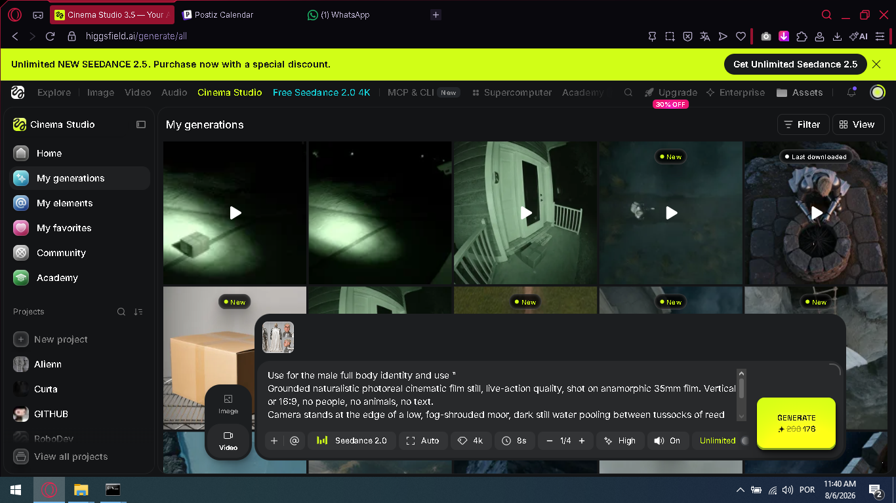
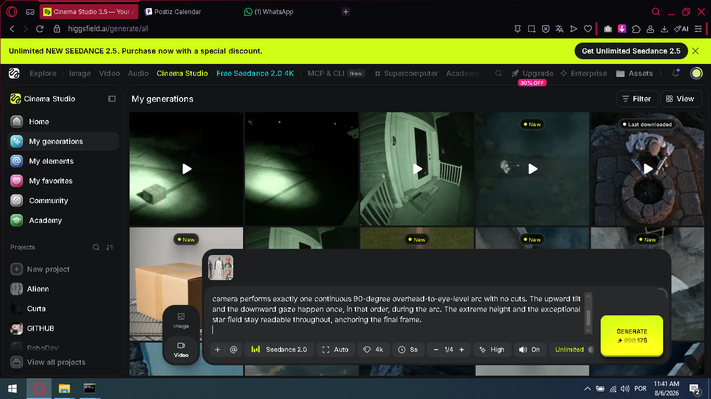
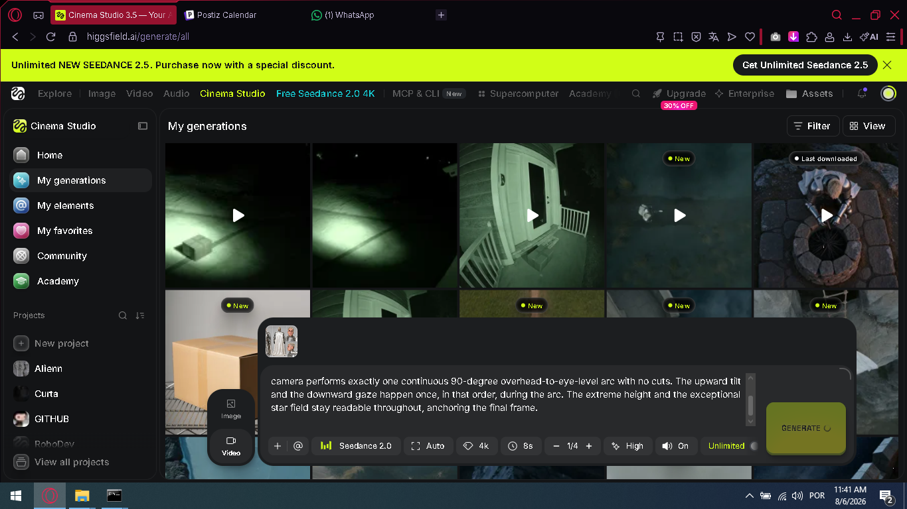
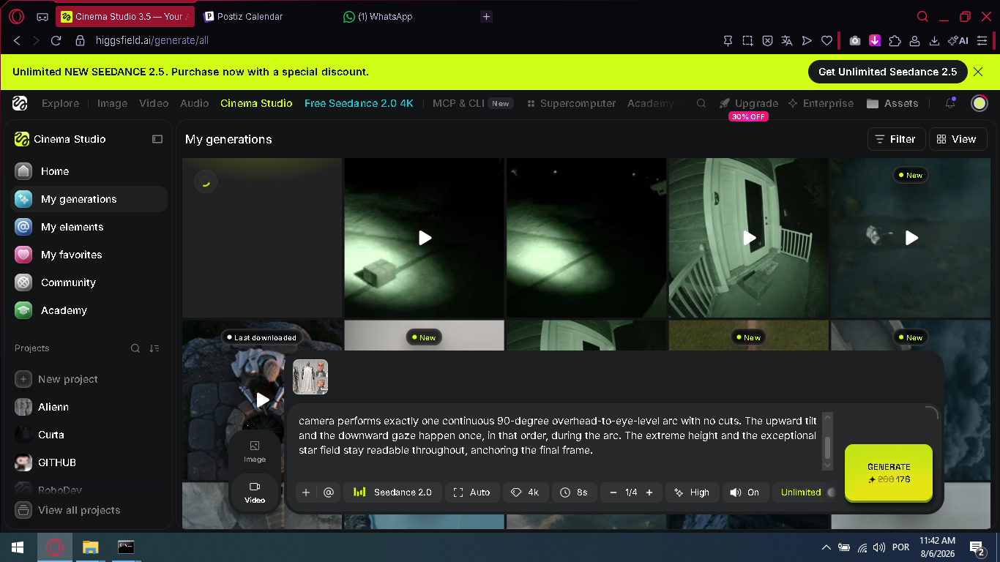

# Higgsfield Browser Automation

[](LICENSE) [](#)

Automate video generation on [Higgsfield](https://higgsfield.ai) (Cinema Studio / Seedance)
through the browser: paste a prompt, hit Generate, verify it landed, repeat — either one
prompt at a time or as an unattended overnight loop that fires a new generation every
15 minutes.

This exists because **Higgsfield has no working MCP tool for generation**. Their MCP server
(`https://mcp.higgsfield.ai/mcp`) only does OAuth login; the actual generation tools never
load into an agent session. So instead of calling an API, these scripts drive the real
website with synthetic mouse clicks + clipboard paste, the same way a human would.

Built and validated generating a 34-prompt cinematic knight video series overnight, with
zero manual clicking after the first prompt.

## How it works, step by step

### 1. Open Higgsfield in the right view

Everything here depends on fixed screen coordinates, so the browser tab has to be in the
exact same view every time: **Cinema Studio → "My generations"**
(`higgsfield.ai/generate/all`). This view shows your grid of past generations with the
prompt box pinned on top of it, your character reference thumbnail on the left of the box,
and the Generate button on the right.



*This is the reference layout the coordinates in `scripts/higgsfield_generate.ps1` are
calibrated for: a 1366×768 maximized browser window, with the yellow "Unlimited NEW
SEEDANCE" promo banner visible at the top.*

**Take a screenshot and actually look at it before trusting the coordinates.** The whole
layout shifts vertically (~32px) depending on whether that yellow banner is showing or not,
and a single wrong click can land you somewhere else entirely — while building this, one
misfire aimed at "bring the browser to front" instead landed on the **Upgrade** button and
navigated the whole tab to the pricing page. If that happens, click **Cinema Studio → My
generations** in the left sidebar again and re-screenshot before continuing.

```powershell
powershell -File scripts\screenshot.ps1 -Out check.png
```

### 2. Paste the prompt and generate

```powershell
powershell -File scripts\higgsfield_generate.ps1 -PromptFile "C:\path\to\prompt.txt"
```

What the script actually does:

1. Click into the prompt textarea.
2. `Ctrl+A` then `Delete` to clear whatever was left in there from the last generation.
3. Load the prompt text into the Windows clipboard (`Set-Clipboard`) and `Ctrl+V` it in.
4. Click the Generate button.
5. Take a confirmation screenshot.

**Clipboard paste, never `SendKeys` with the raw prompt text.** These prompts are long,
multi-paragraph, full of quotes and line breaks — `SendKeys` mangles special characters when
you feed it text directly. Copy-paste via the clipboard is reliable; typing it character by
character is not.



*Confirmation screenshot after paste — read this before clicking Generate. Check that the
visible tail of the text matches the end of the prompt you meant to send (the textarea only
shows the last few lines, so this is your only signal the paste didn't land somewhere else
or get truncated).*

### 3. Verify it actually fired

After clicking Generate, the button switches to a loading spinner and a new cell with a
spinning-loader icon appears in the **top-left** of the generations grid.



Wait a bit and screenshot again — the new generation should show up as a distinct tile:



**Always read the screenshot with an actual image-viewing step before declaring success.**
Don't infer success just because the PowerShell command returned without throwing — the
click coordinates can silently miss (wrong window focus, banner shifted the layout, a modal
was open) and the script has no way to detect that from inside PowerShell alone.

## Running an entire prompt queue unattended (overnight loop)

Save each prompt as its own file, `prompt<N>_only.txt`, in one folder. One file per prompt
is more reliable than one giant file you slice by line range, and it lets you resume from
any point without re-parsing anything.

```powershell
Start-Process powershell -ArgumentList '-NoProfile','-ExecutionPolicy','Bypass','-File', `
  'scripts\higgsfield_loop.ps1','-PromptDir','C:\project\prompts','-Order','1,2,3,4,5' `
  -WindowStyle Hidden
```

This runs in the background, generates one prompt every 15 minutes (Higgsfield's queue
doesn't reliably keep up with faster submission), retries once per prompt on failure, and
logs everything (with a screenshot after every generation) to `auto_generate_log.txt` in
the same folder.

### The one thing that will bite you

**This does not survive the machine sleeping, hibernating, or rebooting.** The PowerShell
process just dies with the OS. This is exactly what happened building this: a loop was
generating a 34-prompt overnight queue, running fine every 15 minutes, and then the laptop
shut down mid-run — the process silently stopped after prompt 27 of 34, with no error, no
log entry, nothing. The only reason it got noticed and finished was a human coming back and
checking the log against the prompt count.

Before starting a long unattended run:
- Disable auto-sleep for the session: `powercfg /change standby-timeout-ac 0`
- Leave the browser window un-minimized and don't let anything else steal focus — the
  synthetic clicks go to whatever's under the cursor at those coordinates, not to a specific
  window handle.

### Recovering after the machine comes back

1. Check whether the loop process is actually still alive:
   ```powershell
   Get-CimInstance Win32_Process -Filter "Name = 'powershell.exe'" |
     Where-Object { $_.CommandLine -like '*higgsfield_loop*' } |
     Select-Object ProcessId, CreationDate
   ```
   Careful: the verification command itself is a `powershell.exe` process, and if you grep
   its own command line text it can appear to "duplicate-match" itself in the list. Check
   process ID and creation time, not just presence in the list.
2. Read the log to see exactly which prompts made it through.
3. Higgsfield auto-downloads finished videos into your `Downloads` folder as
   `hf_<timestamp>_<uuid>.mp4` once the tab reloads or the browser session restores — you
   don't need to click "download" on each tile by hand.
4. Resume the loop with only the prompts that didn't fire, using `-Order`.

## Files

| File | Purpose |
|---|---|
| `scripts/screenshot.ps1` | Full-screen screenshot, for verifying layout/state before and after every action. |
| `scripts/higgsfield_generate.ps1` | Paste one prompt and click Generate, once. |
| `scripts/higgsfield_loop.ps1` | Background loop over an ordered list of prompt numbers, 15 min apart, with logging and retries. |

## Why not just use the API / MCP

Higgsfield does expose an MCP server, and `codex mcp login higgsfield` successfully
authenticates via OAuth — but the generation tools never actually surface inside the agent's
tool list after login (confirmed via `codex mcp list` showing `Auth: OAuth`, `Status:
enabled`, with the tools simply absent). Also worth knowing: the "Unlimited" plan's
unlimited generation only applies when generating through **the website** — generating via
MCP/CLI/API burns credits even with Unlimited active. So driving the actual site is not just
a workaround for a missing feature, it's also the version of the product that's actually
unlimited.
